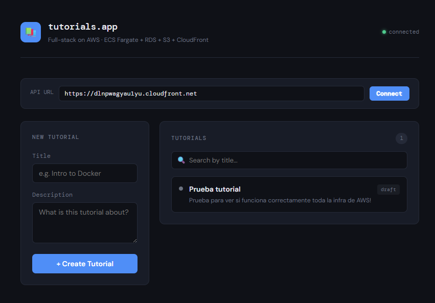

# aws-fullstack-app

Full-stack application deployed on AWS using ECS Fargate, RDS PostgreSQL, S3 and CloudFront.



## Architecture

```
CloudFront (HTTPS)
├── /* → S3 (frontend)
└── /api/* → ALB → ECS Fargate (backend) → RDS PostgreSQL
```

- **Frontend**: Static HTML/JS served from S3 via CloudFront
- **Backend**: Node.js + Express + Sequelize running on ECS Fargate
- **Database**: PostgreSQL on RDS (private subnets)
- **CI/CD**: GitHub Actions deploys on every push to `main`
- **Infrastructure**: Terraform with S3 remote state

## Requirements

- AWS account with an IAM user that has admin permissions
- GitHub repository with the following secrets configured:
  - `AWS_ACCESS_KEY_ID`
  - `AWS_SECRET_ACCESS_KEY`
  - `DB_PASSWORD`

## Deploy

Push to `main` and GitHub Actions will automatically:

1. Create infrastructure with Terraform (~10 min first time, RDS takes longest)
2. Build and push Docker image to ECR
3. Deploy new container to ECS
4. Upload frontend to S3 and invalidate CloudFront cache

## Usage

1. Go to the CloudFront URL (shown in the GitHub Actions logs as `cloudfront_url`)
2. Type the CloudFront URL in the **API URL** field and click **Connect**
3. Create, publish and delete tutorials

## Tear down

To destroy all infrastructure and stop AWS charges:

```bash
cd terraform
terraform init
terraform destroy -var="db_password=YOUR_PASSWORD"
```

Empty S3 and ECR first if Terraform gives errors:

```bash
aws s3 rm s3://aws-fullstack-app-frontend-ACCOUNT_ID --recursive
aws ecr delete-repository --repository-name aws-fullstack-app-backend --force --region us-east-1
```
